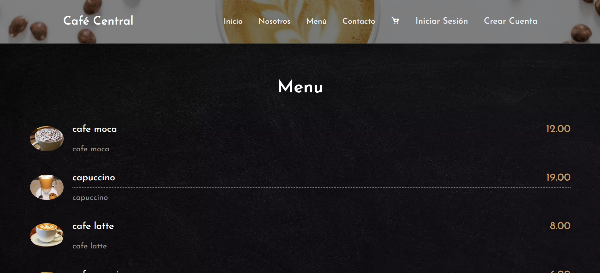
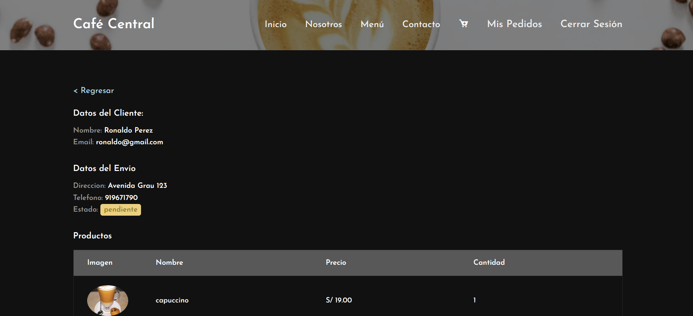
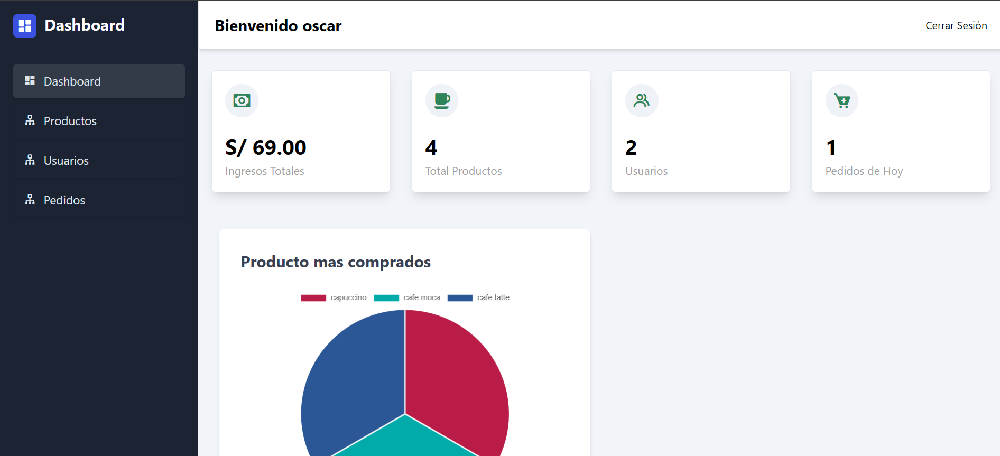

# Sistema web - Cafe Central

Proyecto realizado que incluye un sistema de gestión para administradores y una pagina web que permite a los usuarios realizar pedidos en linea. 

**Backend:** Implemente la lógica de negocio utilizando PHP e interactuando con la base de datos con SQL, se genero las operaciones CRUD para los diferentes modulos del sistema, como pedidos, inventario, clientes, etc.

**Frontend:** Se desarrollo una interfaz de usuario intuitiva y responsiva utilizando HTML, CSS, y el preprocesador SASS, tambien se hizo uso de javascript para la interaccion con el DOM, y la realización de peticiónes asincronas.


Para iniciar el proyecto en su maquina debe seguir los siguientes pasos:

- ubicarse en la carpeta public desde la terminal

```
cd public
```

- Ejecutar el siguiente comando: php -S localhost:4000

```
php -S localhost:4000
```

- Colocar en su navegador http://localhost:4000


### Visuales
---


--

--

--
